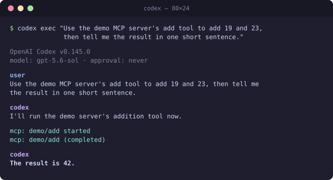

# Your First Conversation

What talking to an MCP client *actually looks like* — a complete
session between an AI agent and the
[demo server](../../source/apps/mcpdemo.pas), shown twice: as the
user saw it, and as your server saw it on the wire. The transcripts
are from 2026-08-10; the client versions shown are the releases
current on that date.

## The user's view

The demo server was registered with the Codex CLI (v0.145.0) and
asked one question:



The agent decided on its own that the `add` tool fit the question,
called it, and used the answer. That's the whole consumer experience:
your tool became something the model reaches for.

Claude Code works the same way — register and check with:

```sh
claude mcp add demo /path/to/build/mcpdemo
claude mcp list        # → demo: … - ✔ Connected
```

## The same session on the wire

Three requests — plus one notification — travelled over the server's
stdin/stdout. Everything below your handler's one line of arithmetic
was produced by the library.

**1. The client introduces itself** — the `initialize` handshake
(this client speaks protocol revision `2025-06-18`; the library
serves it via its dual-era support without any configuration):

```json
{"jsonrpc":"2.0","id":0,"method":"initialize","params":{
  "protocolVersion":"2025-06-18",
  "capabilities":{"elicitation":{"form":{},"url":{}}},
  "clientInfo":{"name":"codex-mcp-client","title":"Codex","version":"0.145.0"}}}
```

The server answers with its identity and the `Instructions` you set —
the text the model reads to learn when to use your server:

```json
{"jsonrpc":"2.0","id":0,"result":{
  "protocolVersion":"2025-06-18",
  "capabilities":{"tools":{},"resources":{},"prompts":{}},
  "serverInfo":{"name":"pascal-mcp-sdk-demo","version":"0.1.0"},
  "instructions":"Demo server for the pascal-mcp-sdk library. Use \"echo\" to mirror a message, \"add\" to add two numbers; read mcp://pascal-mcp-sdk/greeting for a hello."}}
```

The client then confirms the handshake with a notification (no
response expected):

```json
{"jsonrpc":"2.0","method":"notifications/initialized"}
```

**2. Discovery** — the client asks what you offer and hands the
catalog to the model. Note that your `RegisterTool` call became a
JSON Schema the model uses to shape its arguments:

```json
{"jsonrpc":"2.0","id":1,"method":"tools/list","params":{"_meta":{"progressToken":0}}}
```

```json
{"jsonrpc":"2.0","id":1,"result":{"tools":[
  {"name":"echo","description":"Echo a message back to the caller", "inputSchema":{"…":"…"}},
  {"name":"add","description":"Add two numbers and return the sum",
   "inputSchema":{"type":"object",
     "properties":{"a":{"type":"number"},"b":{"type":"number"}},
     "required":["a","b"]}, "…":"…"}]}}
```

**3. The model calls your tool.** The arguments match the schema —
the library has already validated them before your handler runs
(client-specific `_meta` bookkeeping elided):

```json
{"jsonrpc":"2.0","id":2,"method":"tools/call","params":{
  "name":"add","arguments":{"a":19,"b":23},"_meta":{"…":"…"}}}
```

**4. Your handler's result goes back** — human-readable `content`
plus the `structuredContent` matching the tool's output schema (the
float is serialized in FPC's exponent form; every client reads it as
plain JSON 42):

```json
{"jsonrpc":"2.0","id":2,"result":{
  "content":[{"type":"text","text":"The sum is 42"}],
  "isError":false,
  "structuredContent":{"sum":4.2E+001}}}
```

Then the model told the user "The result is 42." — and when the
session ended, the host closed the server's stdin and the process
exited. That EOF-means-shutdown contract is why a pascal-mcp-sdk
server needs no signal handling and no restart loop.

## What Claude Code sends

Same choreography from Claude Code (versions 2.1.217 and 2.1.226
both open with this):

```json
{"jsonrpc":"2.0","id":0,"method":"initialize","params":{
  "protocolVersion":"2025-11-25",
  "capabilities":{"roots":{"listChanged":true},"elicitation":{}},
  "clientInfo":{"name":"claude-code","title":"Claude Code","version":"2.1.226"}}}
```

Different client, different protocol revision (`2025-11-25` vs
Codex's `2025-06-18`) — same server, zero configuration. That is what
the dual-era default buys you: the library speaks each classic
handshake revision it supports (`2024-11-05`, `2025-06-18`,
`2025-11-25` — the revisions current clients use) *and* the newest
stateless `2026-07-28` revision, and picks per connection — so as
clients migrate to the stateless revision, your server needs no
change (see [Configuration](configuration.md#dualera)).

## The same conversation, stateless style

Under the `2026-07-28` revision there is no handshake at all — every
request is self-contained, carrying its `_meta`. You can hold this
conversation yourself from a shell:

```sh
./build/mcpdemo <<'EOF'
{"jsonrpc":"2.0","id":1,"method":"tools/call","params":{"name":"add","arguments":{"a":19,"b":23},"_meta":{"io.modelcontextprotocol/protocolVersion":"2026-07-28","io.modelcontextprotocol/clientCapabilities":{}}}}
EOF
```

One line in, one line out — same handler, same result, no protocol
session.
The [cookbook](cookbook.md#driving-it-all-by-hand) drives the whole
surface this way.

## Takeaways

- Your handler ran **once**, with validated typed arguments; the
  library produced every other byte on this page.
- Model-facing text matters: the tool `description` and the server
  `Instructions` are what made the model pick `add` unprompted.
- Clients disagree about protocol revisions today — the dual-era
  default absorbs that so you never have to ask which client your
  users run.
