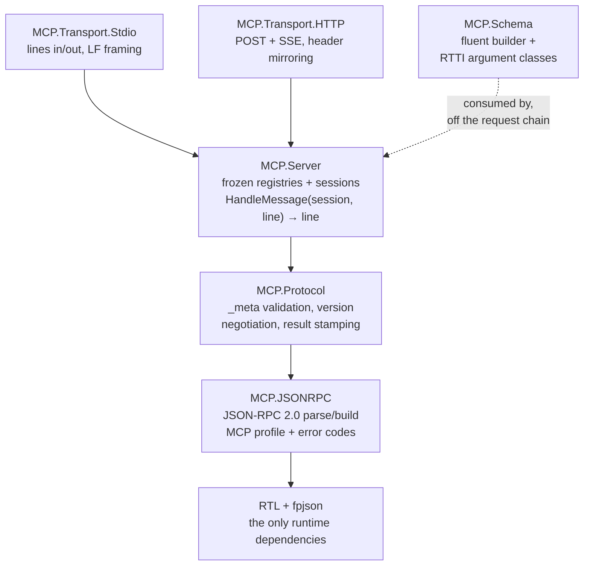
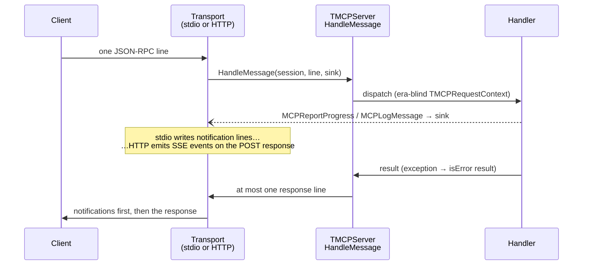
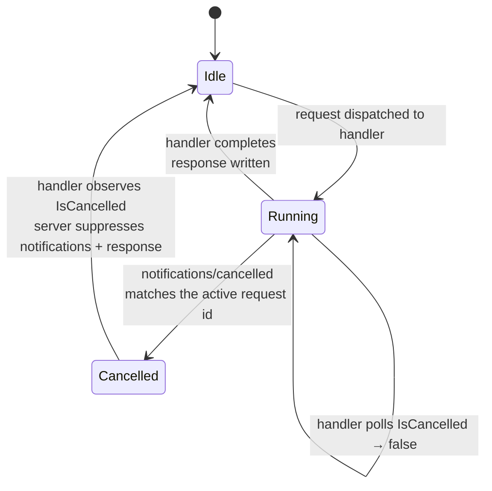
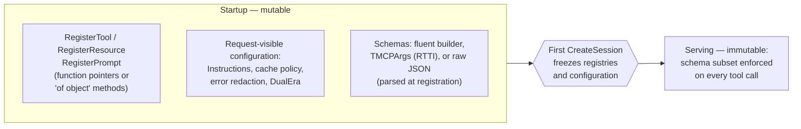
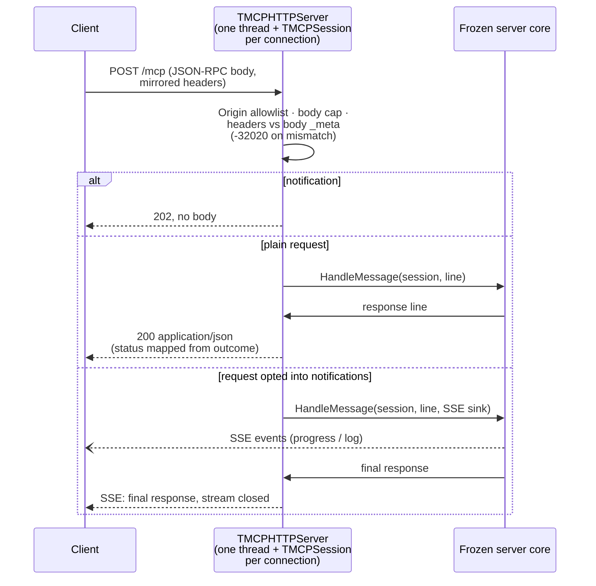

# Architecture

> **Audience: contributors.** This describes the library's internals
> and toolchain; consumers only need the
> [guides](../guides/quick-start.md) and
> [reference](../reference/server.md) sections.

## Executive Summary

pascal-mcp-sdk is six units layered strictly bottom-up. Four form the
request chain — `MCP.JSONRPC` (the JSON-RPC 2.0 profile MCP mandates),
`MCP.Protocol` (the stateless per-request `_meta` model of spec
revision 2026-07-28), `MCP.Server` (the sans-I/O dispatch core), and a
transport shell (`MCP.Transport.Stdio` or `MCP.Transport.HTTP`) — and
`MCP.Schema` sits beside the chain as the schema helper `MCP.Server`
consumes. The core performs no I/O: `CreateSession` binds connection
state and `HandleMessage` maps one inbound line to at most one
response line, so both transports wrap the same tested core without
touching it. The runtime dependency set is FPC's RTL + fpjson (plus
fcl-web, shipped inside FPC, confined to the HTTP transport unit),
nothing else.

## Layering

The strict bottom-up request chain is `MCP.JSONRPC` → `MCP.Protocol` →
`MCP.Server` → transport. `MCP.Schema` sits to the side of that chain:
a helper `MCP.Server` consumes to build and enforce tool schemas, not
a layer a request passes through.

Rules live in the layer that owns them and nowhere else:

| Unit | Owns | Knows nothing about |
| --- | --- | --- |
| `MCP.JSONRPC` | Message classification (request / notification / invalid), MCP's tightened id rules (string or number, never null), batch rejection, params-must-be-object, id preservation into error replies, compact single-line serialization | MCP methods |
| `MCP.Protocol` | The reserved `_meta` keys, the two required per-request fields (`protocolVersion`, `clientCapabilities`), `-32602` for their absence, `-32022` (+ `supported` list) for version mismatch, response-side stamping (`resultType: "complete"`, `serverInfo`) | Tools and resources |
| `MCP.Server` | Method dispatch (`server/discover`, `tools/*`, `resources/*`, `prompts/*`), frozen registries and request-visible configuration, per-connection legacy state, cooperative cancellation, in-band vs. protocol error policy (handler exceptions → `isError: true` results; dispatch faults → JSON-RPC errors), the legacy-`initialize` rejection that names supported versions | Bytes and streams |
| `MCP.Schema` | The fluent builder (`ObjectSchema.AddString(...)`) and the RTTI-derived `TMCPArgs` argument classes, both emitting the JSON Schema 2020-12 subset the server enforces | Dispatch, bytes, streams |
| `MCP.Transport.Stdio` | LF-terminated writes on every platform, CR tolerance on reads, blank-line skipping, stderr-only logging, EOF as the graceful-shutdown signal | Protocol decisions — it contains not a single one |

## The sans-I/O core

`TMCPServer.CreateSession` creates state bound to that server, and
`TMCPServer.HandleMessage(ASession, const ALine; out AResponse): Boolean`
is the line-oriented protocol surface. Unit tests drive both directly
(no pipes, no processes); `RunMCPStdioLoop` creates one session for
its connection and passes it on every call; `MCP.Transport.HTTP` does
the same per HTTP request. This mirrors duetto's `WS.Protocol`
discipline: one tested core, transports as delivery.

Passing nil or a session from another server is API misuse and raises
`EMCPServer`; malformed wire input is still converted to JSON-RPC
errors.

### Request-scoped notifications

The one addition to line-in/line-out is the **per-call notification
sink**: the sink and its user data are arguments to the
`HandleMessage` overload, so neither shared server state nor a session
retains transport state.

Handlers emit request-scoped notifications (`MCPReportProgress`,
`MCPLogMessage`) that the active transport writes before the response
— exactly the stream the spec describes for both stdio and Streamable
HTTP (where the same sink becomes SSE events on the POST response).
Emission is strictly opt-in per request (`_meta.progressToken` for
progress; the `logLevel` key for log messages, severity-filtered per
RFC 5424), and both helpers are no-ops without a sink, so the core
stays testable without I/O.

### Statelessness, sessions, and cancellation

Modern 2026-07-28 requests remain **stateless**: every request
validates its own `_meta`, and the session contributes no negotiated
identity to that path. The session exists for two things only —
isolating legacy lifecycle/identity, and exposing the one currently
active cooperative-cancellation token.

`notifications/cancelled` validates its payload, matches string ids by
decoded value and numeric ids by value, and flips that token; handlers
poll `TMCPRequestContext.IsCancelled`, after which the server
suppresses notifications and the final response. The synchronous stdio
read-handle-write loop cannot receive a cancellation while a handler
is running, so stdio handlers should stay short; a future transport
with mid-request delivery points can use the same session entry point.

## Registration and handler model

Registries and request-visible configuration (`Instructions`, cache
policy, error redaction, and dual-era mode) are populated at startup
and freeze when the first session is created. That is why no
`listChanged`/`subscribe` capability is advertised and
`subscriptions/listen` is out of v1.

Handlers are synchronous and come in two shapes per registry — plain
function pointers and `of object` method pointers — so both programs
and class-based hosts (lantaarn) register naturally.

Tool schemas come from `MCP.Schema` in two forms:

- **The fluent builder** — `ObjectSchema.AddString(...)...`, a JSON
  Schema 2020-12 subset covering the flat object schemas most tools
  need, with input and output schema overloads.
- **Argument classes** — `TMCPArgs` descendants whose published
  properties expand into the schema via RTTI (`SchemaFrom`), with the
  server binding, validating, and populating a typed instance per call
  (missing/mistyped arguments become in-band `isError` results before
  the handler runs). Classes rather than records because FPC 3.2.2
  RTTI has no record field names.

Richer schemas use the JSON-string or definition-object overloads,
parsed for well-formedness at registration (`EMCPServer` on error).

### MRTR — Multi Round-Trip Requests

**MRTR** (SEP-2322; #4) is the 2026-07-28 replacement for
server-initiated requests:

- A `tools/call` or `prompts/get` handler that needs more input
  returns `MCPInputRequired(...)` / `MCPPromptInputRequired(...)` — an
  `input_required` result carrying an `inputRequests` map (entry
  builders for elicitation form/url, `sampling/createMessage`,
  `roots/list`) and the handler's opaque `requestState`.
- The client retries the original request with `inputResponses` plus
  the echoed state, and the library re-enters the *same handler* with
  both exposed on `TMCPRequestContext` — each round is one ordinary
  `HandleMessage` call, so the server stays stateless across rounds.
- Kinds are gated on the per-request client capabilities (`-32021`
  when undeclared), and the whole mechanism is modern-era only.
- Sampling and roots are deprecated in the final spec (SEP-2577) but
  carried deliberately — each kind is one builder plus one accessor,
  so a later sunset is cheap.

Proven against the official client's auto-fulfilment driver in all
three interop batteries and by `mcpsmoke`.

### Per-call schema enforcement

Since the HTTP era inverted the trust boundary (#23), **every
raw-handler tool call is validated against its registered schema's
enforceable subset before the handler runs** — `type`, `description`,
`title`, `properties`, `required`, `enum`, `default`, exactly the
dialect the builders emit (the fluent builder stamps non-empty
`description`s, which the server accepts without
`.ApplicationValidated`) — with violations returned as in-band
`isError` results, the same shape the typed path produces.

- Absent optional arguments are seeded with their schema `default`.
- Unknown argument properties are ignored (the same tolerance the
  typed path applies to unknown keys).
- A raw schema using keywords outside the subset fails at freeze
  unless the registration is marked `.ApplicationValidated` — the
  documented escape hatch that hands argument validation back to the
  handler.
- Deeper, semantic validation remains the handler's job, reported as
  in-band `isError` results that a model can read and correct against.

## Spec grounding

Verified 2026-07-20 against the RC pages; re-verified 2026-08-08
against the published final text
([modelcontextprotocol.io](https://modelcontextprotocol.io)):

- The **current ratified** revision is `2026-07-28` — final shipped
  July 28, 2026
  ([versioning](https://modelcontextprotocol.io/specification/versioning)).
  It removes the `initialize` handshake, protocol-level sessions, the
  `Mcp-Session-Id` header, and the GET SSE stream; server→client
  requests are replaced by Multi Round-Trip Requests.
- This library implements `2026-07-28` from the pinned final pages:
  [transports overview](https://modelcontextprotocol.io/specification/2026-07-28/basic/transports),
  [stdio binding](https://modelcontextprotocol.io/specification/2026-07-28/basic/transports/stdio),
  [`_meta` + error codes](https://modelcontextprotocol.io/specification/2026-07-28/basic/index),
  [versioning](https://modelcontextprotocol.io/specification/2026-07-28/basic/versioning),
  [server/discover](https://modelcontextprotocol.io/specification/2026-07-28/server/discover),
  [tools](https://modelcontextprotocol.io/specification/2026-07-28/server/tools),
  [resources](https://modelcontextprotocol.io/specification/2026-07-28/server/resources).
- The 2026-08-08 re-verification diffed the
  [final changelog](https://modelcontextprotocol.io/specification/2026-07-28/changelog)
  against the RC surface this library implements and re-ran the
  interop batteries on the **stable** SDKs
  (`@modelcontextprotocol/client` 2.0.0, `@modelcontextprotocol/sdk`
  1.30.0): **no drift** on the implemented surface — the RC facts the
  library absorbed (top-level `serverInfo`, required
  `ttlMs`/`cacheScope`, `-32020..-32022` error codes,
  resource-not-found `-32602`, per-request `logLevel` gating) all
  appear unchanged in the final text.
- **The prose pages are not the whole truth — the schema anchor is.**
  Interop against the official TypeScript client (via
  `tools/interop-ts/`) surfaced two requirements the prose pages
  underplay: `DiscoverResult` requires a **top-level `serverInfo`**
  field (the `_meta` stamp alone reads as a legacy server to the
  probe), and `ttlMs` + `cacheScope` (SEP-2549 CacheableResult) are
  **required** on discover/list/read results. Both are implemented and
  pinned by unit tests, `mcpsmoke`, and the interop battery. Protocol
  claims should be checked against the
  [schema](https://github.com/modelcontextprotocol/modelcontextprotocol/blob/main/schema/2026-07-28/schema.ts)
  and a real client implementation, not prose alone.

### Dual-era support

pascal-mcp-sdk is a **dual-era server** (spec's compatibility matrix,
on by default): era selection follows how the client opens.

- A request carrying the modern per-request `_meta` protocol-version
  key is served statelessly per 2026-07-28.
- An `initialize` request selects legacy semantics for `2024-11-05`,
  `2025-06-18`, and `2025-11-25`, scoped to the connection's
  `TMCPSession` — the deliberate cross-request state the compatibility
  model prescribes, isolated even when sessions share one server core.
- `2025-03-26` is excluded because its Base Protocol requires
  receivers to accept JSON-RPC batches, which this library does not
  implement
  ([Base Protocol](https://modelcontextprotocol.io/specification/2025-03-26/basic),
  verified 2026-07-20).
- Both eras run concurrently on the same instance; handlers are
  era-blind (`TMCPRequestContext` is filled from `_meta` or from the
  stored handshake).
- The legacy dialect is era-faithful at the edges: no
  `resultType`/`serverInfo` stamps, no SEP-2549 cache fields,
  resource-not-found `-32002`, and `ping` answered.
- `DualEra := False` restores strict modern-only behavior (initialize
  rejected with a diagnostic naming supported versions, as the spec
  recommends).

Proven end-to-end by `tools/interop-ts`: the stable v2 client
negotiates modern (auto-probe included), the v1 SDK client (Claude
Code's library) completes the classic handshake, and Claude Code
itself connects via `claude mcp add`.

## The HTTP binding

`MCP.Transport.HTTP` is the second transport shell (Streamable HTTP,
2026-07-28 profile): every JSON-RPC message is its own POST to a
single `/mcp` endpoint.

The binding's rules, all transport-owned:

- Requests that opt into request-scoped notifications
  (`_meta.progressToken` / `logLevel`) on handler-backed methods are
  answered as SSE streams — events first, final response last, stream
  closed after; notifications answer `202`.
- The mirrored metadata headers (`MCP-Protocol-Version`, `Mcp-Method`,
  `Mcp-Name` with the base64 sentinel) are validated against the body
  before dispatch (`-32020` on mismatch).
- JSON-RPC outcomes map onto HTTP statuses: `-32601` → 404;
  parse/invalid/`-32020..-32022` → 400; everything else 200.
- The Origin allowlist plus the `127.0.0.1` default binding implement
  the spec's DNS-rebinding defenses.
- The server primitive is FPC's own `fphttpserver` (fcl-web ships
  inside FPC 3.2.2, the same reading of the dependency rule that
  admits fpjson), confined to the transport unit.
- The binding is modern-only (`DualEra := False`): legacy clients keep
  using stdio.
- Each connection runs on its own thread with its own `TMCPSession`
  against the frozen core — the concurrency model the v1.2.0 state
  split was built for.

One SDK-anchor fact lives in the transport (verified 2026-08-08
against `@modelcontextprotocol/client` 2.0.0): the official client
derives the mirrored headers from the body's `_meta` envelope and
sends its pre-negotiation `server/discover` probe with no mirrored
header, so header validation keys on the envelope claim rather than
demanding the header on literally every POST. This is only about not
masking the request with a `-32020` header error: the body still
carries `_meta` (`server/discover` does, like every request), and the
core still answers `-32602` for a request missing it — the header
tolerance never lets a bare-`_meta` request succeed (spec verified
2026-08-08:
[server/discover](https://modelcontextprotocol.io/specification/2026-07-28/server/discover)).
Proven end-to-end by the `tools/interop-ts` Streamable HTTP battery
(`http-interop.mjs`) driving `mcpdemo --http`, including streamed
progress notifications.
