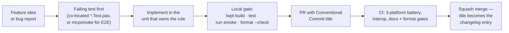

# Contributing Changes

> **Audience: contributors.** This is the one path every change takes
> — feature or fix, the steps are the same. Consumers only need the
> [guides](../guides/quick-start.md) and
> [reference](../reference/server.md) sections.

## Executive Summary

A change lands here by proving itself: a failing test first, the
implementation in the one unit that owns the rule, the local gate
(`lwpt build` + `test` + `mcpsmoke` + `format --check`) green, and a
Conventional-Commit-titled PR through CI's cross-platform and
cross-implementation batteries. Features and fixes walk the same
path — a fix simply starts from a reproducing test instead of a new
one.



## Set up once

- **FPC 3.2.2** — `apt install fpc` / `brew install fpc` / the
  win32+win64 combo installer from
  [freepascal.org](https://www.freepascal.org/download.html). The
  version must be **exactly 3.2.2**: compiler flags are pinned in
  `source/units/MCP.inc` and CI pins 3.2.2 (`fpc -iV` prints yours).
- **lwpt** — the canonical build/test/format entry point. Download
  the release tarball for your platform from
  [lwpt's releases](https://github.com/frostney/lwpt/releases),
  verify the checksum, put `lwpt` on PATH. Do not invoke `fpc`
  directly except as `fpc @lwpt.cfg`.
- **lefthook** — `lefthook install` once per clone wires the
  formatting pre-commit hook.
- **Node ≥ 20** — only for the interop harness (`tools/interop-ts/`)
  and the website (`website/`).

Then:

```sh
git clone https://github.com/frostney/pascal-mcp-sdk
cd pascal-mcp-sdk
lwpt install     # resolve deps, regenerate lwpt.cfg + lwpt.lock
lwpt build       # build/mcpdemo + build/mcpsmoke
lwpt test        # co-located unit suites
lwpt run smoke   # E2E battery: spawns mcpdemo, drives the protocol
```

`lwpt install --frozen` is the CI mode: verify the lockfile and the
committed modules without touching the network. (Windows CI currently
skips `--frozen` pending
[lwpt#78](https://github.com/frostney/lwpt/issues/78).)

## Start from a test

Every change starts with the test that would have caught it:

- **Fixing a bug?** Write the test that reproduces it — in the
  co-located suite of the unit that owns the behaviour
  (`source/units/MCP.<Area>.Test.pas`), or in `mcpsmoke` if it only
  shows up over a real transport. Watch it fail, then fix.
- **Adding a feature?** Write the test that specifies it. Test names
  state the rule being proven, spec-style
  (`'null id → -32600 (MCP forbids null ids)'`), so a failing run
  reads as a conformance report — see [Code Style](code-style.md).
- **Changing protocol behaviour?** The test cites the spec page it
  proves, and the implementation carries the citation + verification
  date. Spec facts are **verified, never recalled** — check the
  [schema anchor](https://github.com/modelcontextprotocol/modelcontextprotocol/blob/main/schema/2026-07-28/schema.ts)
  and a real client, not prose alone (see
  [Architecture § Spec grounding](architecture.md#spec-grounding)).

## Put the change where it belongs

Layering is strictly bottom-up, and each rule has exactly one home —
the ownership table in
[Architecture § Layering](architecture.md#layering) says which unit
owns what. The short version:

- Wire shape, id rules, error envelopes → `MCP.JSONRPC`.
- `_meta`, versioning, result stamping → `MCP.Protocol`.
- Dispatch, registries, sessions, error policy → `MCP.Server`.
- Schema building/derivation → `MCP.Schema`.
- Framing and byte movement → the transport units, which move lines
  only and never re-decide a protocol rule.

If a change seems to need protocol knowledge inside a transport (or
I/O inside the core), the design is wrong — re-read the layering
before writing code.

Three ground rules bound every change (the full set lives in
[AGENTS.md](../../AGENTS.md); the reasoning behind them is recorded in
the ADRs under
[docs/adr/](https://github.com/frostney/pascal-mcp-sdk/tree/main/docs/adr)):

- **FreePascal only** — FPC 3.2.2, Delphi mode, flags centralised in
  `MCP.inc`; no second compiled language, no per-unit directives.
- **Zero third-party runtime dependencies** — RTL + fpjson only
  (fcl-web ships inside FPC and stays confined to
  `MCP.Transport.HTTP`).
- **Public API changes update the reference docs** — every public
  `MCP*`/`Register*` symbol must appear in `docs/reference/`;
  `.github/scripts/check-reference-docs.sh` fails CI otherwise.

## Run the gate locally

```sh
lwpt build             # both apps compile
lwpt test              # unit suites
lwpt run smoke         # E2E: mcpsmoke drives mcpdemo over pipes
lwpt format --check    # formatter drift (pre-commit fixes in place)
lwpt health            # complexity within the manifest ceilings
lwpt duplication       # token clones within the manifest ceiling
```

While iterating, `lwpt test` takes selectors — a path or glob runs
just the suites you're working on
(`lwpt test source/units/MCP.Server.Test.pas`), and
`lwpt test --inventory` lists every registered suite and case as
JSON without running anything.

Protocol-surface changes should also run the interop battery — the
official MCP TypeScript clients against `mcpdemo`:

```sh
cd tools/interop-ts
npm ci
npm run interop
```

Nothing in the test stack touches the external network: pipes,
loopback sockets, and temp files only.

## Open the PR

- **Title is a Conventional Commit** (`feat: …`, `fix: …`,
  `docs: …`). The repo squash-merges, so the title becomes the commit
  subject and the changelog entry — `pr-title.yml` gates it, with
  allowed types read from `cliff.toml`.
- CI must be green across the board. What runs
  (see [Tooling § CI](tooling.md#ci)):

| Gate | Proves |
| --- | --- |
| Linux / macOS / Windows legs | checksum-verified lwpt install, `install --frozen`, build, unit suites, mcpsmoke on every platform |
| `fpc @lwpt.cfg` leg | the zero-install path still works |
| `interop` (required) | the official TypeScript clients still talk to `mcpdemo` — a red interop job is a real cross-implementation regression |
| format / agents `--check` | formatter and AGENTS.md command block have not drifted |
| `check-reference-docs.sh` | every public symbol is documented in `docs/reference/` |
| health / duplication | complexity and token-clone ceilings in `lwpt.toml` hold — ratchets set just above the adoption-day baseline, so they shrink but never grow unnoticed |
| markdownlint | docs follow `.markdownlint-cli2.jsonc` |
| pages.yml (on `docs/`/`website/` changes) | the website still builds; broken internal doc links fail here |

- Reverting via GitHub's Revert button produces a `Revert "..."`
  title git-cliff cannot parse — retitle it
  `revert: <original description>`.

[DEFINITION_OF_READY.md](../../DEFINITION_OF_READY.md) and
[DEFINITION_OF_DONE.md](../../DEFINITION_OF_DONE.md) define what makes
work startable and finished here.
